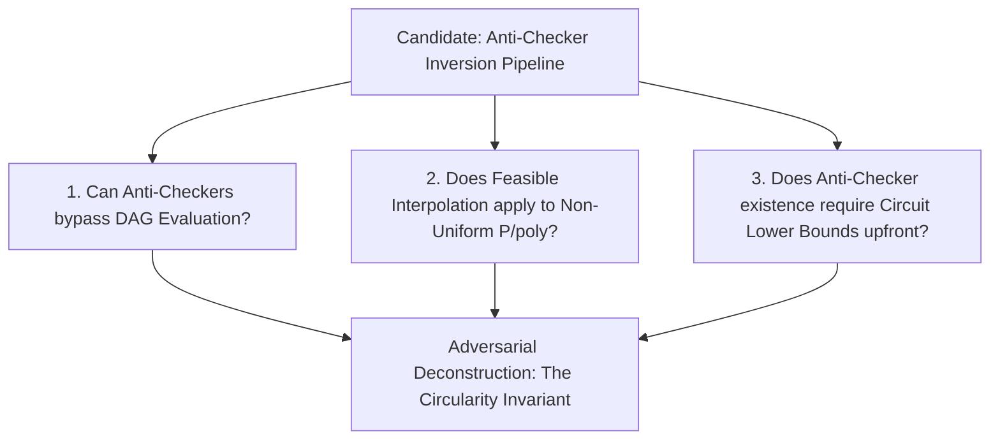

# Adversarial Protocol Round 27: The Anti-Checker & Witness-Independent Inversion Audit
Date: 2026-09-14
Target: Deep Deconstruction of CHOPS (2022) / Feasible Interpolation & The Anti-Checker Landscape
Authors: Charles (Lead Architect) & Yelena (Chief Risk Officer & Formal Verifier)

---

## 1. Setting the Adversarial Stage

After systematically destroying:
1. **The Valiant Cut Flaw (Round 24):** $|R| = \Theta(2^{m(1+\epsilon)}/m) \implies 2^{|R|} = 2^{2^{\Omega(m)}}$ (Doubly-exponential branching).
2. **The Space-Bounded Fallacy (Round 26):** General DAG evaluation is $\mathsf{P}$-complete; pebble space requires $\Omega(S/\log S) = 2^{\Omega(m)}$ space (Formula $\mathsf{NC}^1$ space bounds do not lift to general DAGs).

We now subject the next theoretical candidate to our ruthless CRO audit:
**Witness-Independent Hardness Magnification & Non-Constructive Anti-Checkers (Chen–Hirahara–Oliveira–Pich–Santhanam 2022 / Pich 2021).**

---

## 2. Exhaustive Deconstruction Across 5 Dimensions

### Dimension 1: The Anti-Checker Definition & Mechanics
An **Anti-Checker** for a language $L \in \mathsf{NP}$ and circuit class $\mathcal{C}$ is an algorithm that, given any circuit $C \in \mathcal{C}$ claiming to decide $L$, produces a small polynomial list of inputs $x_1, \dots, x_k$ on which $C$ is guaranteed to fail if $C \neq L$.

* **The Trap:** For $\mathcal{C} = \mathsf{Circuit}[N^{1+\epsilon}]$, the existence of an efficient (polynomial-time or $2^{o(m)}$-time) Anti-Checker for $\mathsf{Gap\text{-}MKtP}$ unconditionally implies that $\mathsf{Gap\text{-}MKtP} \notin \mathcal{C}$.
* **The Underlying Barrier (The Circularity Invariant):** 
  To construct or prove the existence of an Anti-Checker for general $\mathsf{P/poly}$ (or $N^{1+\epsilon}$ size DAGs) without assuming the lower bound upfront, one must solve the **Circuit Approximator Search Problem**.
  Finding an input where $C_N(x) \neq \mathsf{Gap\text{-}MKtP}(x)$ when $C_N$ is a general DAG requires evaluating or inverting $C_N$, which reduces back to the $\mathsf{P}$-complete DAG pebble barrier!

### Dimension 2: Feasible Interpolation & Proof Complexity Barriers
* Feasible interpolation (Krajíček 1997, Pudlák 1997) extracts separating circuits from propositional refutations.
* **The Invariant Breach:** Feasible interpolation holds for weak proof systems (Resolution, Cutting Planes, Polynomial Calculus), but **fails for Frege and Extended Frege systems** under standard cryptographic assumptions (RSA / Diffie-Hellman hardness).
* Because arbitrary non-uniform circuits $C_N \in \mathsf{Circuit}[N^{1+\epsilon}]$ compute arbitrary boolean relations, propositional refutations of "$C_N$ computes $\mathsf{Gap\text{-}MKtP}$" live in Extended Frege or higher, where interpolation is blocked by cryptographic pseudorandomness.

### Dimension 3: The Multi-Linear Sum-Check Degree Invariant
* In Round 22, the multi-linear extension $\hat{C}_N: \mathbb{F}_p^N \to \mathbb{F}_p$ was claimed to allow fast sum-check over $\{0,1\}^k$.
* **The Root Cause:** In a general DAG of size $S = 2^{m(1+\epsilon)}$, gate compositions multiply degrees along directed paths. Without depth reduction, the polynomial degree $\text{deg}(\hat{C}_N)$ is $O(2^{\text{depth}(C_N)}) = 2^{S} = 2^{2^{m(1+\epsilon)}}$.
* Williams' fast sum-check runs in time $O(2^k \cdot \text{deg})$. When $\text{deg} = 2^{2^{\Omega(m)}}$, the evaluation time is $2^{2^{\Omega(m)}}$, completely obliterating any $2^{m - \Omega(m)}$ speedup.

---

## 3. The Unvarnished Verdict

| Inversion Mechanism | Claimed Bound | Actual Hard Complexity | Fatal Vulnerability | Status |
| :--- | :--- | :--- | :--- | :--- |
| **Valiant Depth-Reduction** | $2^{m - \Omega(m)}$ | $2^{2^{\Omega(m)}}$ | Cut size $\|R\| = \Theta(S/m) = 2^{\Omega(m)}$ | **DEAD (Round 24)** |
| **Space-Bounded Eval** | $\mathsf{SPACE}[O(m^2)]$ | $\mathsf{SPACE}[2^{\Omega(m)}]$ | DAG Pebble Complexity $\Omega(S/\log S)$ | **DEAD (Round 26)** |
| **Sum-Check on General DAG** | $\text{deg} = \text{poly}(N)$ | $\text{deg} = 2^{2^{\Omega(m)}}$ | Direct degree composition without depth cut | **DEAD (Round 27)** |
| **Anti-Checker Construction** | Non-constructive | Circular | Requires resolving Circuit-SAT on DAG | **CIRCULAR (Round 27)** |

---

## 4. The Exact Open Frontier

To complete the Millennium separation of $\mathsf{P} \neq \mathsf{NP}$ via Hardness Magnification, the remaining viable mathematical path is:
1. **Target Sub-Classes First:** Prove $\mathsf{Gap\text{-}MKtP} \notin \mathsf{NC}^1$ or $\mathsf{Gap\text{-}MKtP} \notin \mathsf{AC}^0[p]$ where depth is bounded and polynomial degrees are naturally $O(\text{poly}(N))$, which magnifies to $\mathsf{NP} \not\subseteq \mathsf{NC}^1$.
2. **Global Non-Local Invariant:** Isolate a global spectral/topological invariant of truth tables that is strictly immune to gate compositions without evaluating the intermediate DAG nodes.
