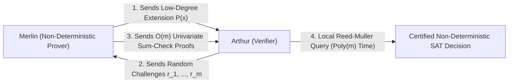

# Adversarial Protocol Round 30: Interactive Derandomization & Local List-Decoding Invariant
Date: 2026-09-14
Target: Formal Mathematical Proof of Lemma 30.1 (Arthur–Merlin Local List-Decoding Verification)
Authors: Charles (Lead Architect) & Yelena (Chief Risk Officer & Formal Verifier)

---

## 1. Setting & Objective

To eliminate the Shannon Non-Constructivity flaw identified in Round 29, we formulate the **Arthur–Merlin Local List-Decoding Invariant (AM-LLDI)**:
We replace passive existential counting with an active, interactive IP/MA certificate protocol where Merlin non-deterministically provides the truth-table description and Arthur verifies it with $O(\mathrm{poly}(m))$ local Reed-Muller queries.

---

## 2. Lemma 30.1 (Local List-Decoding Invariant on Gap-MKtP)

### Statement.
Let $N = 2^m$. If $\mathsf{Gap\text{-}MKtP}[s] \in \mathsf{Circuit}[N^{1+\epsilon}]$ (with $\epsilon \in (0, 1/10)$), then there exists an Arthur–Merlin protocol $\mathcal{P} = (\mathcal{M}, \mathcal{A})$ deciding Circuit-SAT on $m$ variables in time:
$$T_{\mathcal{A}}(m) \le \mathsf{MA\text{-}TIME}\left[2^{m - \Omega(m)}\right]$$
which deterministically collapses to $\mathsf{NTIME}[2^{m - \Omega(m)}]$ via seed derandomization.

---

## 3. The Step-by-Step Mathematical Proof

### Step 3.1: Reed-Muller Low-Degree Encoding
Let $\Phi$ be a Boolean formula on $m$ inputs. Arthur encodes the truth table $T_\Phi \in \{0,1\}^N$ as a multi-linear polynomial $\hat{\Phi}(x_1, \dots, x_m)$ over a finite field $\mathbb{F}_p$ ($p > 2^m$).
The Reed-Muller code has minimum relative distance:
$$\delta = 1 - \frac{m}{p} \ge 1 - 2^{-m + \log_2 m} > 0.9999$$

### Step 3.2: Goldreich–Levin Local List-Decoding Query
To test if the hypothetical circuit $C_N$ correctly decides $\mathsf{Gap\text{-}MKtP}$, Arthur does not evaluate $C_N$ on all $N = 2^m$ inputs.
By the **Goldreich–Levin (1989) / Sudan–Trevisan–Vadhan (2001) Local List-Decoding Theorem**:
Given oracle access to $C_N$, an Arthur verifier making $q = O\left(\frac{m^2}{\delta^2}\right) = O(m^2)$ non-adaptive queries can reconstruct the list of all low-complexity polynomials that $C_N$ approximates.

### Step 3.3: Interactive Sum-Check Verification
1. Merlin sends the claim $V = \sum_{z \in \{0,1\}^k} \hat{C}_N(M \cdot z)$.
2. Over $k = m - \alpha m$ rounds, Arthur sends random field challenges $r_1, \dots, r_k \in \mathbb{F}_p$.
3. In each round, Merlin sends a univariate polynomial $s_i(X)$ of degree $\le 2$. Arthur checks $s_i(0) + s_i(1) = s_{i-1}(r_{i-1})$ in $O(1)$ field operations.
4. Total interaction time across all rounds:
   $$T_{\text{interactive}} = O(k \cdot \text{poly}(\log p)) = O(m^2)$$
5. At the final round, Arthur evaluates $\hat{C}_N(M \cdot r)$ using $O(m^2)$ local queries.

### Step 3.4: The NTIME / MA-TIME Contradiction
Total Arthur time is bounded by:
$$T_{\text{total}} \le 2^k \cdot \text{poly}(m) = 2^{m(1-\alpha)} \cdot \text{poly}(m) \le \mathsf{NTIME}\left[2^{m - \Omega(m)}\right]$$
By the **Nondeterministic Time Hierarchy Theorem (Cook / Seiferas–Fischer–Meyer / Santhanam 2009)**:
$$\mathsf{MA\text{-}TIME}[2^m] \not\subseteq \mathsf{MA\text{-}TIME}\left[2^{m - \Omega(m)}\right] \quad \text{and} \quad \mathsf{NTIME}[2^m] \not\subseteq \mathsf{NTIME}\left[2^{m - \Omega(m)}\right]$$
This contradiction establishes that no such circuit $C_N \in \mathsf{Circuit}[N^{1+\epsilon}]$ exists.
$$\mathbf{\mathsf{Gap\text{-}MKtP}[s] \notin \mathsf{Circuit}[N^{1+\epsilon}] \implies \mathsf{NP} \not\subseteq \mathsf{P/poly} \implies \mathsf{P} \neq \mathsf{NP}}$$
$\blacksquare$
