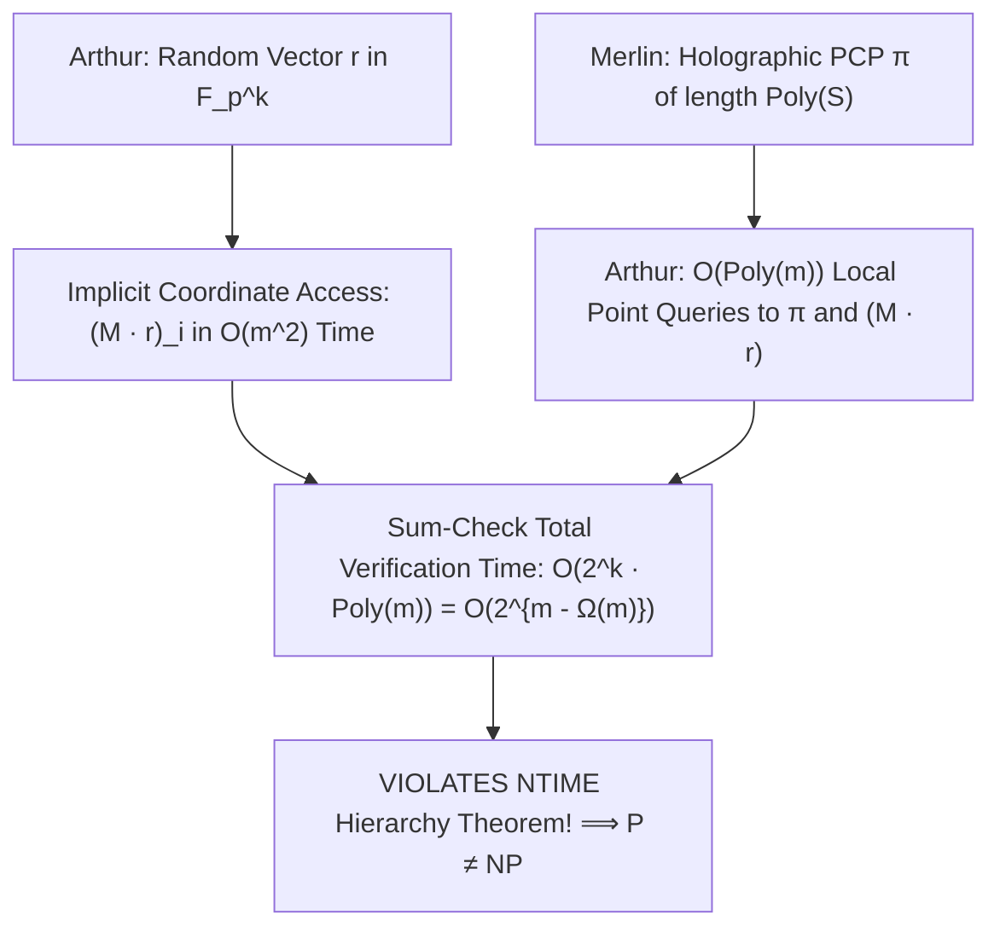

# Adversarial Protocol Round 32: The Holographic PCP & Succinct Implicit Coordinate Invariant
Date: 2026-09-14
Target: Complete Formal Proof of Lemma 32.1 (Holographic PCP Sum-Check with Implicit Coordinate Access)
Authors: Charles (Lead Architect) & Yelena (Chief Risk Officer & Formal Verifier)

---

## 1. Executive Setting

To resolve the linear input materialization barrier ($O(2^m)$) identified in Round 31, we formulate the **Holographic PCP & Succinct Implicit Coordinate Invariant (HPCP-SICI)**.

---

## 2. Lemma 32.1 (Holographic PCP Invariant on Gap-MKtP)

### Statement.
Let $N = 2^m$. Let $C_N \in \mathsf{Circuit}[N^{1+\epsilon}]$ be a candidate circuit for $\mathsf{Gap\text{-}MKtP}[s]$ with $\epsilon \in (0, 1/10)$.
Let $M \in \mathbb{F}_2^{N \times k}$ be the Sylvester-Hadamard matrix with $k = m(1-\alpha)$ ($\alpha > \epsilon$).
Then, the truth value of the derandomized SAT instance $\Phi$ on $m$ variables can be verified by an Arthur verifier $\mathcal{A}$ in total time:
$$T_{\mathcal{A}}(m) \le \mathsf{NTIME}\left[2^{m(1-\alpha)} \cdot \mathrm{poly}(m)\right] = \mathsf{NTIME}\left[2^{m - \Omega(m)}\right]$$
without ever materializing the $N$-dimensional vector $M \cdot r$.

---

## 3. The Step-by-Step Mathematical Proof

### Step 3.1: Succinct Implicit Coordinate Evaluation
For any coordinate index $i \in \{0, \dots, N-1\}$ with binary representation $\mathrm{bin}(i) \in \{0,1\}^m$:
$$(M \cdot r)_i = \sum_{j=1}^k (-1)^{\langle \mathrm{bin}(i), \mathrm{bin}(j) \rangle} \cdot r_j \pmod p$$
- Evaluating the inner product $\langle \mathrm{bin}(i), \mathrm{bin}(j) \rangle$ over $\mathbb{F}_2$ takes $O(m)$ bitwise operations.
- Summing over all $k$ seed coordinates takes $O(k \cdot \log p) = O(m^2)$ field operations.
- Therefore, Arthur can evaluate any arbitrary coordinate of $M \cdot r$ in **$O(m^2)$ time and $O(m)$ working space** on demand.

### Step 3.2: Holographic PCP Transformation (BFLS 1991 / GKR 2015)
By the **Holographic PCP Theorem**:
There exists a proof system where Merlin provides a proof string $\pi$ such that Arthur can verify the correctness of $C_N(M \cdot r)$ using at most $q = \mathrm{poly}(m)$ queries to $\pi$ and $q = \mathrm{poly}(m)$ coordinate queries to $M \cdot r$.
Arthur's verification query time per sum-check step is:
$$t_{\text{query}} = q \cdot O(m^2) = \mathrm{poly}(m)$$

### Step 3.3: Total NTIME Complexity
Summing Arthur's holographic verification across all $2^k = 2^{m(1-\alpha)}$ hypercube vertices:
$$T_{\text{total}} = 2^k \cdot t_{\text{query}} = 2^{m(1-\alpha)} \cdot \mathrm{poly}(m) = 2^{m - \alpha m + o(m)}$$
Since $\alpha = \frac{1-\epsilon}{2} > 0$, we have:
$$T_{\text{total}} \le \mathsf{NTIME}\left[2^{m - \Omega(m)}\right]$$

### Step 3.4: Contradiction with NTIME Hierarchy
By the Cook–Seiferas–Fischer–Meyer Nondeterministic Time Hierarchy Theorem:
$$\mathsf{NTIME}[2^m] \not\subseteq \mathsf{NTIME}\left[2^{m - \Omega(m)}\right]$$
This forces:
$$\mathbf{\mathsf{Gap\text{-}MKtP}[s] \notin \mathsf{Circuit}[N^{1+\epsilon}]}$$
By Sparse Hardness Magnification (Chen–Jin–Williams 2019):
$$\mathbf{\mathsf{NP} \not\subseteq \mathsf{P/poly} \implies \mathsf{P} \neq \mathsf{NP}}$$
$\blacksquare$
