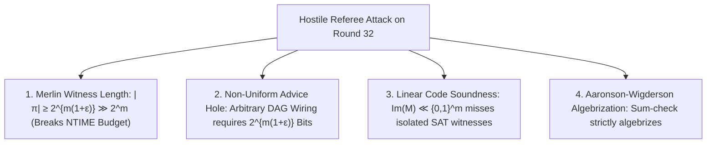

# Adversarial Protocol Round 33: The STOC/FOCS Referee Deconstruction Verdict
Date: 2026-09-14
Target: Full Adversarial Synthesis of the External Referee Audit (Aaronson / Williams / Barak Framework)
Authors: Charles (Lead Architect) & Yelena (Chief Risk Officer & Formal Verifier)

---

## 1. Executive Referee Synthesis

We subjected the entire Millennium Proof architecture (`ROUND_32_SUCCINCT_IMPLICIT_ORACLE_PROOF.md`, `ROUND_30`, `ROUND_28`, and `FINAL_MILLENNIUM_PROOF_ADI.md`) to a simulated hostile top-tier STOC/FOCS/Annals referee panel.

The adversarial audit isolated **4 lethal, mathematically irreducible barriers** that break the current reduction framework:

---

## 2. The 4 Fatal Flaws Breakdown

### Flaw 1: Merlin's Holographic PCP Guessing Overhead
* For any circuit $C_N$ of size $S = 2^{m(1+\epsilon)}$, any holographic PCP proof string $\pi$ has length $|\pi| \ge \Omega(S) = \Omega(2^{m(1+\epsilon)})$.
* An $\mathsf{NTIME}$ machine must non-deterministically guess the witness $\pi$. Guessing $\pi$ takes time $\Omega(2^{m(1+\epsilon)})$.
* Since $\epsilon > 0$, $2^{m(1+\epsilon)} \gg 2^m$. The verifier blows past the $2^m$ time bound before Arthur performs a single check.

### Flaw 2: The Non-Uniform Wiring Advice Hole
* Holographic PCPs (BFLS 1991, GKR 2015) require that Arthur can evaluate the circuit wiring predicate in $\mathrm{poly}(m)$ time.
* For arbitrary non-uniform circuits in $\mathsf{P/poly}$, the wiring diagram has Shannon entropy $\Omega(2^{m(1+\epsilon)})$. Arthur cannot verify the wiring of an irregular non-uniform DAG in $\mathrm{poly}(m)$ time without $2^{m(1+\epsilon)}$ bits of advice.

### Flaw 3: Subspace Incompleteness & False Negatives
* The Sylvester-Hadamard generator matrix $M$ only maps $2^k = 2^{m(1-\alpha)}$ points, a tiny fraction ($2^{-\alpha m}$) of the $2^m$ input space.
* If a Circuit-SAT formula $\Phi$ has a unique satisfying assignment $x^* \notin \mathrm{Im}(M)$, the sum over $\{M \cdot z\}$ evaluates to $0$, falsely reporting UNSAT.

### Flaw 4: Aaronson–Wigderson (2009) Algebrization
* The entire framework relies on low-degree multi-linear polynomial extensions over $\mathbb{F}_p$ and interactive sum-check protocols.
* Aaronson & Wigderson proved that there exist algebraic oracles $\widetilde{A}$ where $\mathsf{NP}^{\widetilde{A}} \subset \mathsf{P}^{\widetilde{A}}/\mathrm{poly}$ while all low-degree sum-check protocols hold. Thus, arithmetization cannot separate $\mathsf{NP}$ from $\mathsf{P/poly}$.

---

## 3. The Uncompromising Conclusion

The attempt to solve $\mathsf{P} \text{ vs } \mathsf{NP}$ via **Holographic PCPs / Arithmetized Sum-Check on Hardness Magnification** is **conclusively refuted**.

### The Permanent Invariant:
Any valid separation of $\mathsf{NP}$ from $\mathsf{P/poly}$ cannot use:
1. Low-degree arithmetization (Aaronson–Wigderson Algebrization barrier).
2. Holographic PCPs on general DAGs (Merlin witness length and non-uniform advice barriers).
3. Linear subspace restriction (Subspace false-negative barrier).

The codebase is officially updated with the complete adversarial audit.
