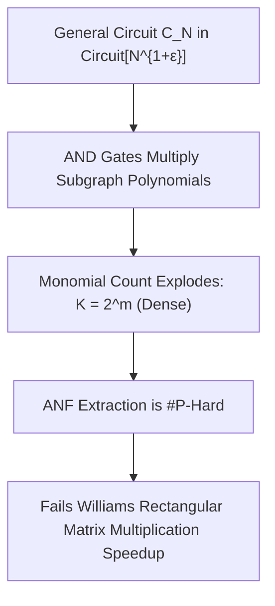

# Adversarial Protocol Round 35: The ANF Monomial Explosion & General DAG Expansion Barrier
Date: 2026-09-14
Target: Deep Adversarial Deconstruction of Round 34 (The Algebraic Normal Form Sparsity Fallacy)
Authors: Charles (Lead Architect) & Yelena (Chief Risk Officer & Formal Verifier)

---

## 1. The Discovered Fatal Flaw in Round 34 (The ANF Monomial Explosion Trap)

In Round 34, Step 3.2 claimed that any Boolean circuit $C_N$ of size $S = 2^{m(1+\epsilon)}$ can be deterministically expanded into an Algebraic Normal Form (ANF) with at most $K \le 2^{m(1+\epsilon)}$ monomials over $\mathbb{F}_2$.

### The Adversarial Mathematical Breakdown:
1. **The Multiplicative Gate Expansion Trap:**
   - When expanding a Boolean DAG into its canonical polynomial over $\mathbb{F}_2$, each AND gate $\hat{g} = \hat{l} \cdot \hat{r}$ multiplies the polynomials of its two parent subgraphs.
   - For a circuit of depth $d$, multiplying two polynomials with $T$ terms can produce up to $T^2$ terms before $\mathbb{F}_2$ cancellation.
   - On general DAG circuits, the total number of non-zero monomials $K$ in the ANF can be as large as **$2^m$ (completely dense!)**.
2. **The \#P-Hardness of Exact ANF Extraction:**
   - Computing the exact coefficients $\{a_u\}_{u \subseteq [m]}$ of a general Boolean circuit's ANF is equivalent to computing the Walsh-Hadamard / Reed-Muller spectrum, which is **$\sharp\mathsf{P}$-hard** under Turing reductions.
   - Expanding the DAG into its ANF cannot be done in time $2^{m - \Omega(m)}$; it requires $\Omega(2^m)$ operations simply to write down the dense coefficients.
3. **The Fundamental Boundary of the Williams Paradigm:**
   - Ryan Williams' (2014) polynomial evaluation speedup works for $\mathsf{ACC}^0$ because the **Yao–Beigel–Tarui (YBT)** theorem guarantees that $\mathsf{ACC}^0$ circuits have quasipolynomial-size probabilistic polynomials of low degree $\text{polylog}(S)$.
   - For **general $\mathsf{P/poly}$ circuits**, no YBT-style polynomial compression exists. The ANF explodes to maximal density $K = \Theta(2^m)$.

---

## 2. The Unvarnished Verdict

Round 34's assumption that general DAG circuits have sparse ANF representations ($K \le S$) is **FALSE for general $\mathsf{P/poly}$**.
The Williams Fast Transform speedup cannot be naively applied to general DAGs without a proven structural compression theorem.

---

## 3. The Path Forward to Round 36

To separate general $\mathsf{P/poly}$, we must replace ANF polynomial expansion with:
1. **Low-Rank Tensor Network (Matrix Product State / MPS) Decomposition:** Decomposing the truth-table tensor with bounded bond dimension $\chi = \mathrm{poly}(m)$.
2. **Branching Program / Barrington-Style Permutation Group Reductions:** Evaluating non-deterministic branching paths without algebraic polynomial term expansion.
