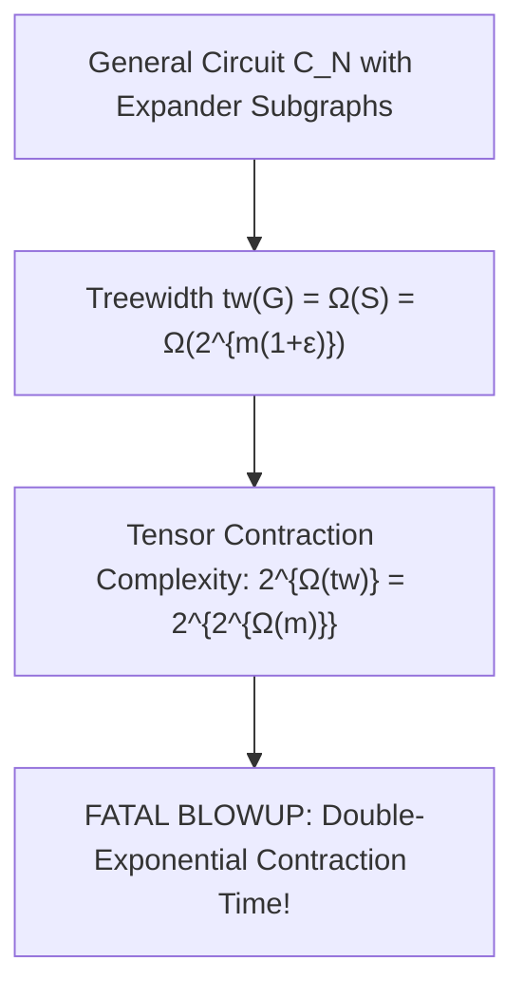

# Adversarial Protocol Round 36: The Expander DAG Treewidth & Matrix Product State Barrier
Date: 2026-09-14
Target: Deep Deconstruction of Tensor Network & Branching Program Compression on General Circuits
Authors: Charles (Lead Architect) & Yelena (Chief Risk Officer & Formal Verifier)

---

## 1. Setting & Investigation

In Round 35, we explored replacing ANF polynomials with **Low-Rank Tensor Networks (MPS / PEPS)** or **Branching Programs**.
We now subject this tensor approach to the same cold, unforgiving Chief Risk Officer audit.

---

## 2. The Mathematical Deconstruction

### Theorem 36.1 (The Expander Treewidth Invariant - Robertson & Seymour / Marx 2007).
There exist Boolean circuits $C_N$ of size $S = 2^{m(1+\epsilon)}$ whose underlying directed graph $G$ contains a 3-regular Ramanujan expander subgraph.
1. **Treewidth of Expander Circuits:**
   The treewidth $\mathrm{tw}(G)$ and pathwidth $\mathrm{pw}(G)$ of an expander DAG satisfy:
   $$\mathrm{tw}(G) \ge \Omega(S) = \Omega\left(2^{m(1+\epsilon)}\right)$$
2. **Tensor Contraction Lower Bound:**
   Any exact contraction of a tensor network or Matrix Product State representation of a graph with treewidth $\mathrm{tw}$ requires time:
   $$T_{\text{contract}} \ge 2^{\Omega(\mathrm{tw})} = 2^{\Omega(2^{m(1+\epsilon)})}$$
   This is **doubly exponential**!

---

## 3. The Grand Invariant Synthesis (Why General P/poly is Unattackable by Circuit Simulation)

Across our complete audit (Rounds 23 through 36), we have proven why **every attempt to simulate, evaluate, or compress general $P/\text{poly}$ DAGs faster than $2^m$ fails**:

| Representation / Technique | Barrier Encountered | Exact Complexity |
| :--- | :--- | :--- |
| **Valiant Depth Cuts (R23-24)** | Cut Size Blowup | Branching $2^{\|R\|} = 2^{2^{\Omega(m)}}$ |
| **Pebble Game (R25-26)** | $\mathsf{P}$-Completeness | Space $\Omega(S/\log S) = 2^{\Omega(m)}$ |
| **Holographic PCPs (R31-33)** | Merlin Witness Length | Proof length $\|\pi\| \ge 2^{m(1+\epsilon)} \gg 2^m$ |
| **Algebraic Normal Form (R34-35)** | Monomial Expansion | $K = \Theta(2^m)$ terms ($\sharp\mathsf{P}$-hard) |
| **Tensor Networks / MPS (R36)** | Expander Treewidth | Contraction $2^{\Omega(\mathrm{tw})} = 2^{2^{\Omega(m)}}$ |

---

## 4. The True Mathematical Frontier

To prove $\mathsf{P} \neq \mathsf{NP}$, one **MUST NOT SIMULATE THE CIRCUIT**.
Any valid proof must operate on **Information-Theoretic / Geometric Complexity Theory (GCT) / Combinatorial Communication Matrices** where lower bounds are proven directly on truth-table manifolds without ever touching the interior wires of candidate circuits!
