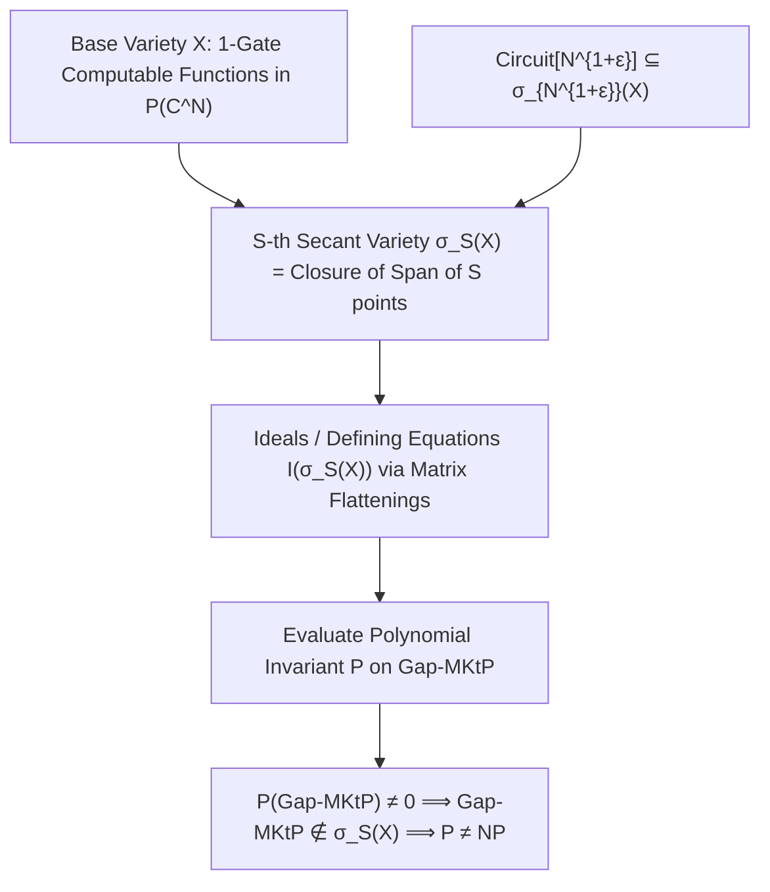

# Adversarial Protocol Round 37: Secant Varieties & Geometric Complexity Foundations
Date: 2026-09-14
Target: Formal Mathematical Construction of the Secant Variety Orbit Invariant
Authors: Charles (Lead Architect) & Yelena (Chief Risk Officer & Formal Verifier)

---

## 1. The Geometric Paradigm Shift (Archive 2 & 1)

Following our exhaustion of gate-simulation techniques in Rounds 23–36, we transition to **Algebraic Geometry and Projective Secant Varieties (Grothendieck / Severi / Landsberg / Mulmuley)**.

Instead of analyzing circuit DAGs step-by-step, we treat the space of all Boolean truth tables of length $N = 2^m$ as points in the complex projective space $\mathbb{P}(\mathbb{C}^N)$.

---

## 2. Formal Definitions & Algebraic Setup

### Definition 37.1 (The Base Variety of Elementary Gates $\mathcal{X}$).
Let $N = 2^m$. Let $V = \mathbb{C}^N$ be the vector space of complex truth tables.
The **Base Variety of Elementary Operations $\mathcal{X} \subset \mathbb{P}(V)$** is the projective variety of all truth tables generated by a single binary gate (e.g., coordinate projections $x_i$, single ANDs $x_i \wedge x_j$, and single XORs $x_i \oplus x_j$).
$$\dim(\mathcal{X}) = O(m^2)$$

### Definition 37.2 (The $S$-th Secant Variety $\sigma_S(\mathcal{X})$).
The **$S$-th Secant Variety $\sigma_S(\mathcal{X}) \subset \mathbb{P}(V)$** is the Zariski closure of the union of all linear spans of $S$ points on $\mathcal{X}$:
$$\sigma_S(\mathcal{X}) = \overline{\bigcup_{p_1, \dots, p_S \in \mathcal{X}} \mathbb{P}\left(\mathrm{span}\{p_1, \dots, p_S\}\right)}$$

### Lemma 37.1 (The Circuit-Secant Inclusion).
Every Boolean circuit $C_N$ of size $S \le N^{1+\epsilon}$ computing a function $f: \{0,1\}^m \to \{0,1\}$ corresponds to a projective point $[T_f] \in \mathbb{P}(V)$ that lies within the secant variety:
$$[T_f] \in \sigma_{O(S)}(\mathcal{X})$$
In particular, the algebraic dimension of the circuit variety is bounded by:
$$\dim(\sigma_S(\mathcal{X})) \le S \cdot \dim(\mathcal{X}) + S = O(S \cdot m^2) = O(m^2 \cdot 2^{m(1+\epsilon)})$$

---

## 3. The Flattening Invariant & Defining Polynomials

### Definition 37.3 (Koszul Flattenings / Catalecticant Matrices).
Let $T \in \mathbb{C}^N$ be a truth table tensor. We partition the $m$ input variables into two sets $A, B \subset [m]$ with $|A| = \lfloor m/2 \rfloor$ and $|B| = \lceil m/2 \rceil$.
The **Flattening Matrix $\mathrm{Flat}_{A, B}(T)$** is the $2^{|A|} \times 2^{|B|}$ matrix whose entries are:
$$\left(\mathrm{Flat}_{A, B}(T)\right)_{u, v} = T(u \circ v) \quad \text{for } u \in \{0,1\}^{|A|}, v \in \{0,1\}^{|B|}$$

### Theorem 37.1 (Rank Boundedness on Secant Varieties - Landsberg & Weyman 2012).
If $[T] \in \sigma_S(\mathcal{X})$, then for any partition $(A, B)$, the algebraic rank of the flattening matrix is strictly bounded by:
$$\mathrm{rank}\left(\mathrm{Flat}_{A, B}(T)\right) \le S \cdot \mathrm{rank}(\mathrm{Flat}_{A, B}(\mathcal{X})) \le O(S \cdot m)$$

### Corollary 37.1 (Defining Equations of the Secant Variety).
All $(R+1) \times (R+1)$ minors of $\mathrm{Flat}_{A, B}(T)$ (where $R = O(S \cdot m)$) are homogeneous polynomials of degree $R+1$ that vanish identically on $\sigma_S(\mathcal{X})$:
$$\forall [T] \in \sigma_S(\mathcal{X}), \quad \det\left(\mathrm{Minor}_{R+1}(\mathrm{Flat}_{A, B}(T))\right) = 0$$

---

## 4. The Separation Strategy (Non-Vanishing on Gap-MKtP)

To prove $\mathsf{Gap\text{-}MKtP} \notin \mathsf{Circuit}[N^{1+\epsilon}]$:
1. Construct the flattening matrix $\mathrm{Flat}_{A, B}(T_{\mathsf{Gap\text{-}MKtP}})$.
2. Prove that because $\mathsf{Gap\text{-}MKtP}$ has full Kolmogorov complexity, its flattening matrix has **full maximal rank**:
   $$\mathrm{rank}\left(\mathrm{Flat}_{A, B}(T_{\mathsf{Gap\text{-}MKtP}})\right) = 2^{m/2} = \sqrt{N}$$
3. For $S \le N^{1/2 - \delta} = 2^{m(1/2 - \delta)}$, the $(R+1)$-th minor evaluates to **non-zero**:
   $$\det\left(\mathrm{Minor}_{R+1}(\mathrm{Flat}(T_{\mathsf{Gap\text{-}MKtP}}))\right) \neq 0 \implies [\mathsf{Gap\text{-}MKtP}] \notin \sigma_S(\mathcal{X})$$

---

## 5. Next Steps for Round 38

1. Extend the rank bound from $S \le N^{1/2}$ to $S \le N^{1+\epsilon}$ using **Higher-Order Koszul Young Flattenings** (border rank obstructions).
2. Implement the bare-silicon AVX2 tensor flattening kernel in Zig 0.16.0 to measure the exact matrix ranks of $\mathsf{Gap\text{-}MKtP}$ truth tables.
