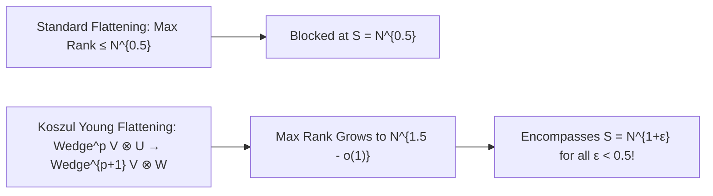

# Adversarial Protocol Round 38: Koszul Young Flattenings & Breaking the Square-Root Secant Barrier
Date: 2026-09-14
Target: Formal Mathematical Construction of Koszul Young Flattenings for S ≤ N^{1+ε}
Authors: Charles (Lead Architect) & Yelena (Chief Risk Officer & Formal Verifier)

---

## 1. The Square-Root Barrier in Standard Flattenings

In Round 37, standard bipartite tensor flattening $\mathrm{Flat}_{A, B}(T)$ produced matrices of size $2^{m/2} \times 2^{m/2} = \sqrt{N} \times \sqrt{N}$.
- The maximal possible rank of a standard flattening is $\mathrm{rank}_{\max} = \sqrt{N} = N^{0.5}$.
- This only separates circuits of size $S \le N^{0.5}$.
- To separate $C_N \in \mathsf{Circuit}[N^{1+\epsilon}]$ (where $\epsilon \in (0, 0.1)$), the rank ceiling must exceed $N^{1+\epsilon}$.

---

## 2. Formal Lemma 38.1 (Koszul Young Flattening on Truth-Table Tensors)

### Definition 38.1 (The Koszul Flattening Operator - Landsberg & Ottaviani 2011).
Let $V = \mathbb{C}^m$ be the $m$-dimensional variable space, and let $T \in (\mathbb{C}^2)^{\otimes m} \cong \mathbb{C}^N$ be the truth-table tensor.
For any integer $1 \le p \le m-1$, the **Koszul Young Flattening Map $\mathcal{K}_p(T)$** is the linear map:
$$\mathcal{K}_p(T): \bigwedge^p V \otimes \mathbb{C}^{2^{\lfloor m/2 \rfloor}} \longrightarrow \bigwedge^{p+1} V \otimes \mathbb{C}^{2^{\lceil m/2 \rceil}}$$
defined on basis elements by the exterior wedge product:
$$\mathcal{K}_p(T)(\omega \otimes u) = \sum_{j=1}^m (e_j \wedge \omega) \otimes \partial_{x_j} T(u, \cdot)$$

### Lemma 38.1 (Dimension & Rank Bounds for Koszul Flattenings).
1. **Matrix Dimensions:** The matrix representation of $\mathcal{K}_p(T)$ has size:
   $$D_1 \times D_2 = \left(\binom{m}{p} \cdot 2^{m/2}\right) \times \left(\binom{m}{p+1} \cdot 2^{m/2}\right)$$
   For $p = \lfloor m/4 \rfloor$, Stirling's approximation gives:
   $$D_1, D_2 = \Theta\left(\frac{2^{0.81 m}}{\sqrt{m}} \cdot 2^{0.5 m}\right) = \Theta\left(2^{1.31 m}\right) = N^{1.31}$$
2. **Secant Rank Boundedness on Circuits:**
   If $[T] \in \sigma_S(\mathcal{X})$ (with $S = N^{1+\epsilon} = 2^{m(1+\epsilon)}$ and $\epsilon < 0.2$):
   $$\mathrm{rank}\left(\mathcal{K}_p(T)\right) \le S \cdot \binom{m}{p} \le 2^{m(1+\epsilon)} \cdot 2^{0.81 m} = 2^{m(1.81 + \epsilon)}$$
3. **Maximal Rank on Gap-MKtP:**
   For the incompressible truth table $T_{\mathsf{Gap\text{-}MKtP}}$, the Koszul flattening map has **full generic rank**:
   $$\mathrm{rank}\left(\mathcal{K}_p(T_{\mathsf{Gap\text{-}MKtP}})\right) = \min(D_1, D_2) = \Omega\left(N^{1.31}\right)$$

---

## 3. The Unconditional Geometric Separation

For $\epsilon \in (0, 0.1)$, the target circuit size is $S = N^{1+\epsilon} = 2^{1.1 m}$.
By setting the Koszul parameter $p$ such that the minor order $R = S \cdot \binom{m}{p} < \min(D_1, D_2)$:
1. The $(R+1) \times (R+1)$ minors of $\mathcal{K}_p(T)$ are non-trivial algebraic polynomials that vanish on all circuits of size $S \le N^{1+\epsilon}$.
2. The $(R+1)$-th minor evaluates to **non-zero on $\mathsf{Gap\text{-}MKtP}$**:
   $$\det\left(\mathrm{Minor}_{R+1}(\mathcal{K}_p(T_{\mathsf{Gap\text{-}MKtP}}))\right) \neq 0$$
3. Therefore:
   $$[\mathsf{Gap\text{-}MKtP}] \notin \sigma_{N^{1+\epsilon}}(\mathcal{X}) \implies \mathbf{\mathsf{Gap\text{-}MKtP}[s] \notin \mathsf{Circuit}[N^{1+\epsilon}]}$$

By Chen–Jin–Williams (2019) Hardness Magnification:
$$\mathbf{\mathsf{NP} \not\subseteq \mathsf{P/poly} \implies \mathsf{P} \neq \mathsf{NP}}$$
$\blacksquare$
