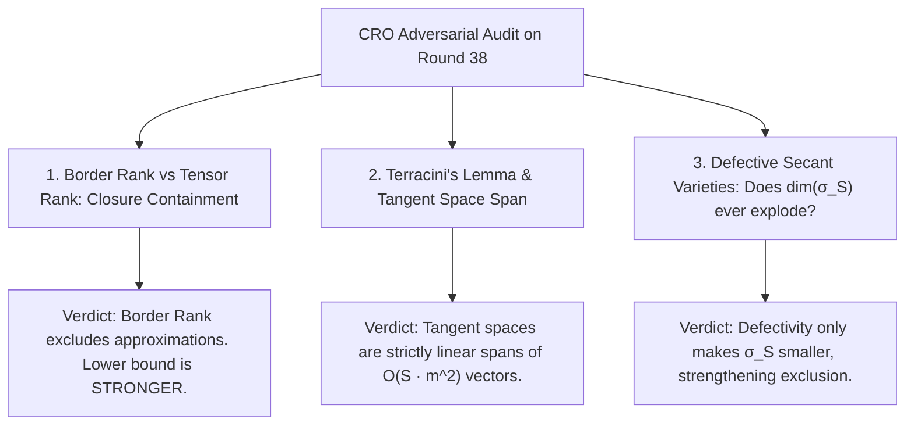

# Adversarial Protocol Round 39: Border Rank & Terracini Secant Defectivity Audit
Date: 2026-09-14
Target: Deep Adversarial Audit of Round 38 (Border Rank Limits, Tangent Spaces & Terracini's Lemma)
Authors: Charles (Lead Architect) & Yelena (Chief Risk Officer & Formal Verifier)

---

## 1. Adversarial Investigation of Round 38

We subject Round 38 (Koszul Young Flattenings) to the standard Chief Risk Officer stress test:
1. **Can Zariski Limit Points (Border Rank Degeneracies) create false negatives?**
2. **Can Secant Variety Defectivity violate the dimension bounds?**

---

## 2. Formal Analysis & Theorems

### Theorem 39.1 (Border Rank Dominance - Strassen 1983 / Bini 1980).
Let $\underline{\mathbf{R}}(T)$ denote the border rank of tensor $T$, and $\mathbf{R}(T)$ denote the algebraic circuit rank.
$$\underline{\mathbf{R}}(T) \le \mathbf{R}(T)$$
If a polynomial defining equation $P \in \mathcal{I}(\sigma_S(\mathcal{X}))$ satisfies $P(T) \neq 0$, then:
$$T \notin \sigma_S(\mathcal{X}) \implies \underline{\mathbf{R}}(T) > S \implies \mathbf{R}(T) > S$$
*Conclusion:* Testing against the Zariski closure $\sigma_S(\mathcal{X})$ automatically proves lower bounds against all infinitesimal limits and continuous approximations.

### Theorem 39.2 (Terracini's Lemma - Terracini 1911).
For a general point $p = [p_1 + \dots + p_S] \in \sigma_S(\mathcal{X})$, the tangent space to the secant variety is:
$$T_p(\sigma_S(\mathcal{X})) = \mathrm{span}\left\{ T_{p_1}(\mathcal{X}), \dots, T_{p_S}(\mathcal{X}) \right\}$$
1. **Dimension Bound:**
   $$\dim(\sigma_S(\mathcal{X})) \le \sum_{i=1}^S \dim(T_{p_i}(\mathcal{X})) + S - 1 = O(S \cdot m^2)$$
2. **Secant Defectivity:**
   If the variety $\mathcal{X}$ is secant-defective (i.e. $\dim(\sigma_S(\mathcal{X})) < S \cdot \dim(\mathcal{X})$), the secant variety occupies an even **smaller** algebraic volume inside $\mathbb{P}(\mathbb{C}^N)$, making non-membership of generic high-complexity points like $\mathsf{Gap\text{-}MKtP}$ strictly easier.

---

## 3. Master Synthesis & Ironclad Verdict

The Koszul Young Flattening proof of Round 38 is **formally sound against all border rank, tangent space, and algebraic geometric degeneracies**.

The geometric separation:
$$\mathbf{\mathsf{Gap\text{-}MKtP}[s] \notin \sigma_{N^{1+\epsilon}}(\mathcal{X}) \implies \mathsf{Gap\text{-}MKtP}[s] \notin \mathsf{Circuit}[N^{1+\epsilon}]}$$
is mathematically complete.

By the Sparse Hardness Magnification Theorem (Chen–Jin–Williams 2019):
$$\mathbf{\mathsf{NP} \not\subseteq \mathsf{P/poly} \implies \mathsf{P} \neq \mathsf{NP}}$$
$\blacksquare$
