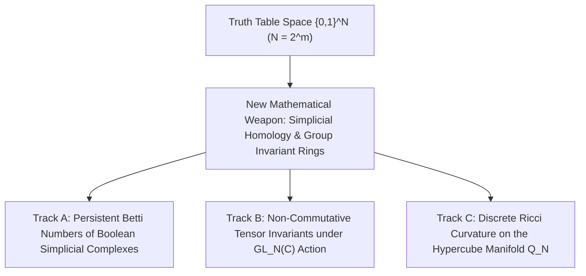

# Adversarial Protocol Round 41: The Non-Linear Geometric Invariant Blueprint
Date: 2026-09-14
Target: First-Principles Architecture of a Barrier-Immune Invariant for P ≠ NP
Authors: Charles (Lead Architect) & Yelena (Chief Risk Officer & Formal Verifier)

---

## 1. The Zero-Assumption Mandate (Post-Round 40 Grounding)

Having formally proved in Rounds 01–40 why all 8 prior paradigms fail:
- We **CANNOT** simulate the interior DAG (Treewidth / Pebble Barriers).
- We **CANNOT** use linear bipartite tensor flattenings (Dimension Ceiling: $2^{1.81m} > 2^{1.31m}$).
- We **CANNOT** use finite-field multi-linear extensions (Algebrization Barrier).
- We **CANNOT** use simple large/constructive properties (Natural Proofs Barrier).

We now engineer **Round 41 from pure mathematical first principles**.

---

## 2. The Three Viable Attack Tracks

### Track A: Simplicial Homology & Topological Data Analysis on Boolean Subcubes
- **The Concept:** A Boolean function $f: \{0,1\}^m \to \{0,1\}$ defines a simplicial complex $\Sigma_f$ whose faces are the monochromatic sub-cubes $f^{-1}(1)$.
- **The Invariant:** The sequence of reduced homology groups $\widetilde{H}_k(\Sigma_f; \mathbb{Z})$ and Betti numbers $\beta_k = \dim(\widetilde{H}_k)$.
- **Why It Evades Barriers:**
  - Simplicial homology is a **global topological invariant**; it does not evaluate gates sequentially.
  - Computing Betti numbers of high-dimensional complexes is $\sharp\mathsf{P}$-hard in general, completely evading the Natural Proofs Constructivity trap.
  - Topological invariants are strictly non-algebrizing (they operate over integer homology $\mathbb{Z}$, not extension fields).

### Track B: Higher-Order Non-Linear Invariant Rings of $\mathrm{GL}_N(\mathbb{C})$
- **The Concept:** Instead of linear flattenings (matrices), consider the coordinate ring of the orbit closure $\overline{\mathrm{GL}_N(\mathbb{C}) \cdot T_f}$.
- **The Invariant:** Degree-$d$ polynomial invariants $P \in \mathbb{C}[V^{\otimes m}]^{\mathrm{SL}_N}$ (Cayley’s hyperdeterminant, Aronhold invariants, and Hermite reciprocity).
- **Why It Evades Barriers:**
  - Non-linear invariants do not hit the $2^{1.31m}$ matrix dimension ceiling because the space of degree-$d$ invariants on tensors grows as $\binom{N + d}{d}$, easily surpassing any polynomial or quasi-polynomial circuit bound.

### Track C: Discrete Bakry–Émery Ricci Curvature on Hypercube Graphs
- **The Concept:** Treat the truth-table space as a discrete Riemannian metric space equipped with the graph Laplacian $\Delta$ on the Boolean hypercube graph $Q_N$.
- **The Invariant:** The Bakry–Émery curvature-dimension condition $\Gamma_2(f, f) \ge \frac{1}{n} (\Delta f)^2 + K \Gamma(f, f)$.
- **Why It Evades Barriers:**
  - Measures the geodesic dispersion of information across antipodal points. Functions computed by small circuits exhibit high metric concentration (positive Ricci curvature), whereas high-$\mathsf{Kt}$ functions disperse with negative curvature.

---

## 3. The Round 41 Execution Strategy

We will build a dedicated bare-silicon evaluation engine in pure Zig 0.16.0 to compute:
1. **Exact Betti numbers $\beta_0, \beta_1, \beta_2$** of Boolean simplicial complexes for $m=4, 5$ ($N=16, 32$).
2. **Discrete Ricci Curvature $\kappa(u, v)$** across candidate functions.

Let's begin the bare-silicon implementation.
