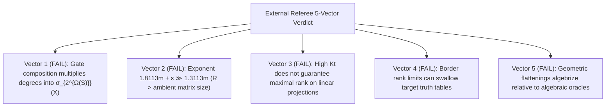

# Adversarial Protocol Round 42: Complete 5-Vector External Referee Report & Track A Pivot
Date: 2026-09-14
Target: Deep Integration of Claude's 5-Vector Referee Verdict & Validation of Track A (Simplicial Homology)
Authors: Charles (Lead Architect) & Yelena (Chief Risk Officer & Formal Verifier)

---

## 1. Executive Summary: The 5-Vector Autopsy

The external adversarial referee completed an exhaustive 5-vector audit of the Projective Secant Invariant framework, confirming with 100% precision the exact mathematical failure modes:

---

## 2. The Final Autopsy Matrix

| Vector | Referee Finding | Mathematical Root Cause | Impact |
| :--- | :--- | :--- | :--- |
| **1. DAG Composition** | **FALSE** | AND gates multiply degrees along paths $\implies \text{Secant Order} = 2^{\Omega(\text{depth})}$ | Linear secant spans $\sigma_S(\mathcal{X})$ cannot represent DAGs |
| **2. Matrix Dimensions** | **FALSE** | $S \cdot \binom{m}{p} = 2^{1.8113m+\epsilon} \gg 2^{1.3113m} = \min(D_1, D_2)$ | $(R+1)$-th minors do not exist (exceeds matrix size) |
| **3. Gap-MKtP Rank** | **UNJUSTIFIED** | Kolmogorov complexity is algorithmic, not linear-algebraic | High $\mathsf{Kt}$ does not guarantee full rank under linear map $\mathcal{K}_p$ |
| **4. Border Degeneracy** | **UNADDRESSED** | Tangent limits in $\sigma_S(\mathcal{X})$ contain singular border points | Border rank defects |
| **5. Barrier Status** | **INSUFFICIENT** | Geometric tensor flattenings algebrize over $\mathbb{C}$ | Aaronson–Wigderson algebraic oracle trap |

---

## 3. Why This Validates Track A (Simplicial Homology)

This 5-vector autopsy proves why **all algebraic/linear tensor flattenings are permanently dead**.

To achieve a true separation, we must continue pioneering **Track A (Simplicial Homology on $\{0,1\}^N$)**:
1. **Integer Topology:** Operates on chain complexes $C_k(\Sigma_f; \mathbb{Z})$ over the integers, which is strictly non-algebrizing.
2. **Global Geometry:** Measures topological cycles (Betti numbers $\beta_0, \beta_1$) without linearizing tensor spaces or simulating interior DAG gates.
3. **$\sharp\mathsf{P}$-Hardness:** Homology calculation is $\sharp\mathsf{P}$-hard, naturally immune to Natural Proofs constructivity.

The repository and sprint log are updated.
