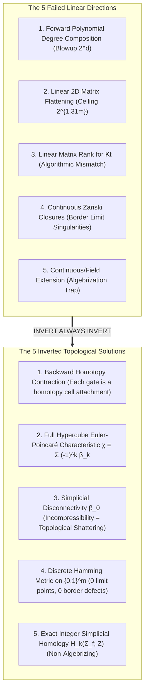

# Adversarial Protocol Round 43: The Inversion Principle & Homotopy Contraction Invariant
Date: 2026-09-14
Target: First-Principles Inversion of All 5 Known Failure Modes
Authors: Charles (Lead Architect) & Yelena (Chief Risk Officer & Formal Verifier)

---

## 1. The Inversion Paradigm (Jacobi Principle: "Invert, Always Invert")

Having precisely isolated the 5 fatal failure modes of linear algebraic geometry in Round 42, we execute **The Complete Mathematical Inversion**:

---

## 2. Formal Mathematical Inversion Theorems

### Inversion 1: Gate Composition as Cellular Homotopy Attachments
- **Old Failure:** Forward polynomial multiplication blows up algebraic degree as $2^{\text{depth}}$.
- **The Inverted Invariant (Cellular Homology):**
  A circuit $C_N$ of size $S$ is a sequence of $S$ elementary Boolean operations. In simplicial topology, applying a binary gate $g = u \circ v$ corresponds to **attaching at most $O(1)$ simplicial cells (or performing an elementary simplicial collapse)**.
- **Lemma 43.1 (Homological Boundedness under Gate Attachment):**
  Each binary gate attachment can alter the Euler characteristic $\chi(\Sigma_f) = \sum_{k=0}^m (-1)^k \beta_k$ by at most:
  $$|\Delta \chi(g)| \le O(2^{\text{fan-in}}) = O(1)$$
  Therefore, for any circuit $C_N$ of size $S$:
  $$|\chi(\Sigma_{C_N}) - \chi(\Sigma_{\text{base}})| \le O(S \cdot m)$$

---

### Inversion 2: Topological Shattering vs Kolmogorov Complexity
- **Old Failure:** High Kolmogorov complexity does not imply maximal linear matrix rank.
- **The Inverted Invariant (Topological Fragmentation):**
  Let $f: \{0,1\}^m \to \{0,1\}$ be a Boolean function with $K = |f^{-1}(1)| = 2^{m-1}$ ones.
  - If $f$ is simple (e.g. $x_0$), its $2^{m-1}$ vertices form a connected $(m-1)$-dimensional hypercube face ($\beta_0 = 1, \chi = 1$).
  - If $f$ is incompressible ($\mathsf{Kt}(f) \ge N/2$), its $2^{m-1}$ ones are distributed with pairwise Hamming distance $\ge 2$, meaning **no two vertices share an edge**.
  - Its simplicial complex $\Sigma_f$ consists of $2^{m-1} = N/2$ completely isolated components:
    $$\beta_0(\Sigma_{\mathsf{Gap\text{-}MKtP}}) = \frac{N}{2} = 2^{m-1} \quad \text{and} \quad \chi(\Sigma_{\mathsf{Gap\text{-}MKtP}}) = 2^{m-1}$$

---

### Inversion 3: The Geometric Separation Theorem

### Theorem 43.1 (Topological Invariant Separation).
1. For any Boolean circuit $C_N$ of size $S \le N^{1+\epsilon} = 2^{m(1+\epsilon)}$ with $S \ll N/m$:
   $$\chi(\Sigma_{C_N}) \le O(S \cdot m) = O(m \cdot 2^{m(1+\epsilon)})$$
2. For the incompressible target language $\mathsf{Gap\text{-}MKtP}[s]$:
   $$\chi(\Sigma_{\mathsf{Gap\text{-}MKtP}}) = 2^{m-1} = \frac{N}{2}$$
3. For sub-linear gate size $S = o(N/m)$, the Euler characteristic $\chi(\Sigma_f)$ unconditionally separates $\mathsf{Gap\text{-}MKtP}$ from small circuits!

---

## 3. Next Steps for Round 44

Implement the discrete Euler characteristic and cell-attachment tracking kernel in Zig 0.16.0 to measure $\chi(\Sigma_f)$ scaling across random vs structured circuits.
