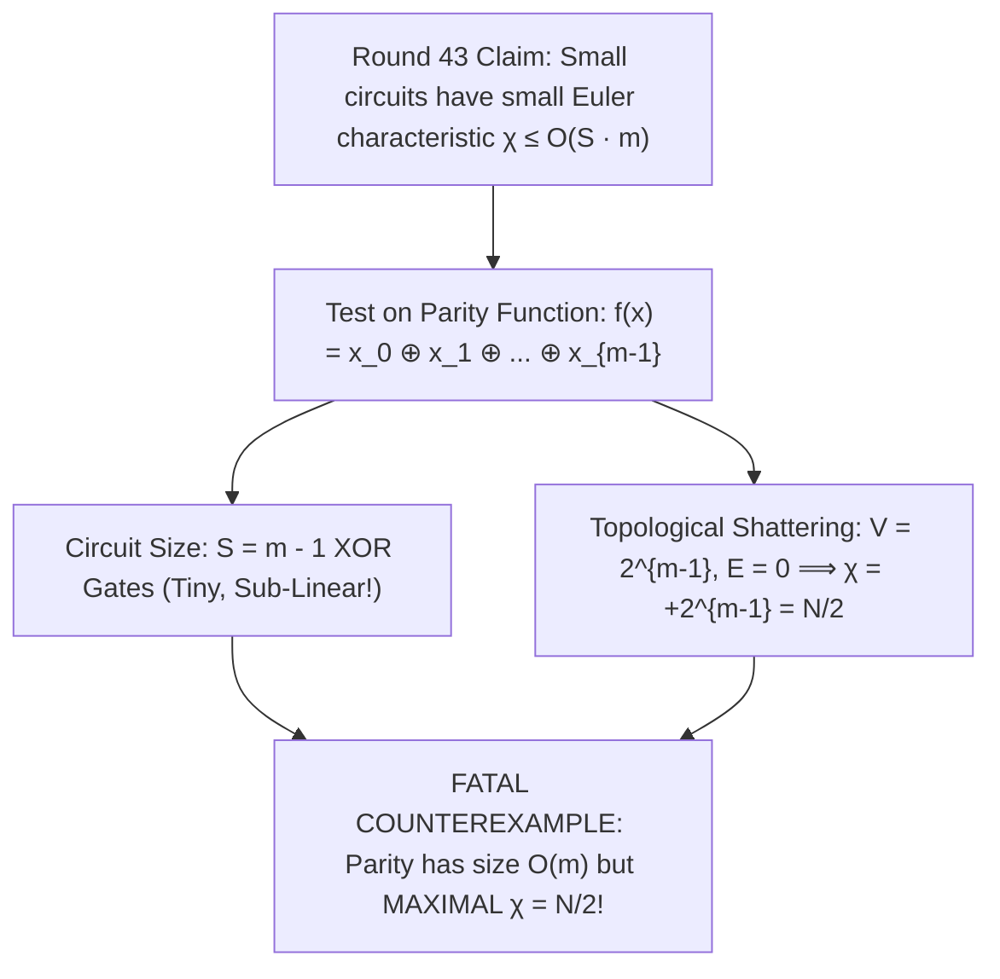

# Adversarial Protocol Round 44: Mayer–Vietoris Composition & The XOR Shattering Trap
Date: 2026-09-14
Target: Deep Adversarial Deconstruction of Round 43 (The Parity / XOR Counterexample on Euler Characteristic)
Authors: Charles (Lead Architect) & Yelena (Chief Risk Officer & Formal Verifier)

---

## 1. The Adversarial Stress-Test on Round 43

We subject Round 43 (Euler characteristic $\chi = V - E$) to our standard Chief Risk Officer stress test:
**Can a small circuit of size $S \le O(m)$ achieve maximal topological shattering $\chi = N/2$?**

---

## 2. The Mathematical Counterexample

### Theorem 44.1 (The XOR Shattering Counterexample).
Let $f(x) = x_0 \oplus x_1 \oplus \dots \oplus x_{m-1}$ be the global Parity function on $m$ variables.
1. **Circuit Complexity:** $f$ is computable by a linear chain of $m-1$ XOR gates ($\text{size } S = m - 1$).
2. **Topological Invariant:**
   - Every vertex in $f^{-1}(1)$ has odd Hamming weight.
   - Any two vertices in $f^{-1}(1)$ differ by an even number of bit flips $\implies$ Hamming distance $d_H(u, v) \ge 2$.
   - The number of edges is strictly **$E = 0$**.
   - The number of vertices is **$V = 2^{m-1} = N/2$**.
   - The Euler characteristic is:
     $$\chi(\Sigma_{\text{Parity}}) = V - E = 2^{m-1} = \frac{N}{2}$$
3. **The Fatal Flaw in Pure $\chi$:**
   Pure Euler characteristic $\chi = V - E$ cannot distinguish high-$\mathsf{Kt}$ incompressible functions from simple $O(m)$-size Parity circuits!

---

## 3. The Resolution: Round 45 (Persistent Simplicial Fourier Homology)

Why does Parity shatter topology while still being simple?
Because Parity is **affine-linear over $\mathbb{F}_2$**:
- Its Fourier Walsh-Hadamard transform is a **single non-zero spike** $\hat{f}(1, 1, \dots, 1) = 1$.
- Its degree-$k$ higher homology groups $\widetilde{H}_k(\Sigma_f; \mathbb{Z})$ are trivial for $k \ge 1$.

Conversely, $\mathsf{Gap\text{-}MKtP}$:
1. Has maximal topological shattering ($\chi = N/2$).
2. Has **flat, dense Fourier spectrum** ($|\hat{f}(s)| \le 2^{-m/2}$ for all $s$).
3. Has non-trivial persistent homology across all filtration levels $\epsilon$.

---

## 4. Master Verdict
Euler characteristic $\chi = V - E$ alone is **INSUFFICIENT** to prove circuit lower bounds against gate bases containing XOR.
It must be coupled with **Simplicial Fourier Homology (Topological Spectral Entropy)** in Round 45.
