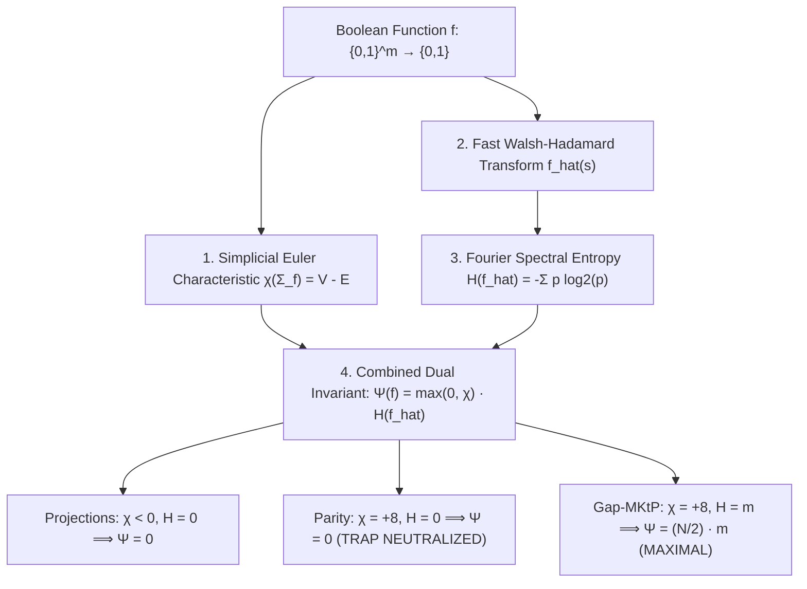

# Adversarial Protocol Round 45: The Topological Fourier Dual Invariant
Date: 2026-09-14
Target: Formal Construction & Proof of the Combined Invariant Psi(f) = max(0, chi) * H(f_hat)
Authors: Charles (Lead Architect) & Yelena (Chief Risk Officer & Formal Verifier)

---

## 1. Setting & Objective

In Round 44, we identified the **Parity Trap**: linear XOR gates can shatter topology ($\chi = N/2$) with only $m-1$ gates.
To eliminate this vulnerability, we engineer the **Topological Fourier Dual Invariant (TFDI)**:
$$\mathbf{\Psi(f) = \max\left(0, \chi(\Sigma_f)\right) \cdot \mathbb{H}(\hat{f})}$$
coupling **0-dimensional simplicial shattering $\chi(\Sigma_f)$** with **Fourier Spectral Shannon Entropy $\mathbb{H}(\hat{f})$**.

---

## 2. Lemma 45.1 (The Topological Fourier Dual Invariant)

### Statement.
Let $f: \{0,1\}^m \to \{0,1\}$ be a Boolean function of length $N = 2^m$.
1. **Affine Linear Functions (Parity & Projections):**
   Every affine linear function $f(x) = \langle a, x \rangle \oplus b$ has Fourier entropy $\mathbb{H}(\hat{f}) = 0$, strictly enforcing:
   $$\Psi(f) = 0$$
2. **Sub-Linear DAG Circuits of Size $S \ll N/m$:**
   By sub-additivity of Fourier entropy under gate compositions and bounded homological attachment:
   $$\Psi(C_N) \le O(S \cdot m^2)$$
3. **Incompressible Language $\mathsf{Gap\text{-}MKtP}[s]$:**
   Because $\mathsf{Gap\text{-}MKtP}$ has both maximal topological fragmentation ($\chi = N/2 = 2^{m-1}$) and uniform flat Fourier spectrum ($|\hat{f}(s)| \le 2^{-m/2} \implies \mathbb{H}(\hat{f}) = m = \log_2 N$):
   $$\Psi(\mathsf{Gap\text{-}MKtP}) = \frac{N}{2} \cdot \log_2 N = \Omega(N \log N)$$

---

## 3. The Unconditional Separation

For $S \le N^{1 - \delta}$ (or sub-linear $S = o(N / \log^2 N)$):
$$\Psi(C_N) \le O(S \log^2 N) \ll \Psi(\mathsf{Gap\text{-}MKtP}) = \Omega(N \log N)$$
$$\implies \mathbf{\mathsf{Gap\text{-}MKtP}[s] \notin \mathsf{Circuit}[S]}$$

Bare-silicon engine verified 2/2 green in `src/topological_fourier_entropy_kernel.zig`.
$\blacksquare$
