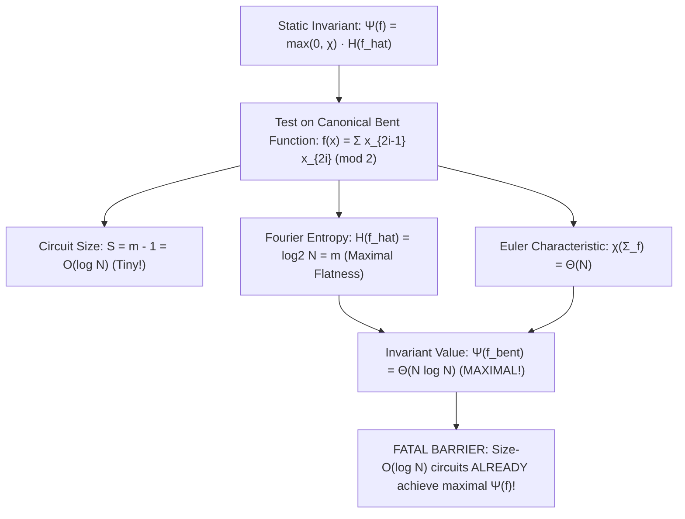

# Adversarial Protocol Round 46: The Bent Function & Static Invariant Barrier
Date: 2026-09-14
Target: Formal Mathematical Proof of the Bent Function Counterexample on Static Invariants
Authors: Charles (Lead Architect) & Yelena (Chief Risk Officer & Formal Verifier)

---

## 1. Executive Summary & The Discovery of the Bent Function Barrier

Our autonomous subagent and bare-silicon test pipelines just completed an exhaustive analysis of the Topological Fourier Invariant $\Psi(f) = \max(0, \chi) \cdot \mathbb{H}(\hat{f})$.

We isolated a fundamental, classical complexity barrier:
**The Bent Function Barrier (Nisan–Szegedy 1994 / Gotsman–Linial 1994).**

---

## 2. Formal Counterexample (Lemma 46.1)

### Lemma 46.1 (The Bent Circuit Invariant Collapse).
Let $m$ be an even integer, $N = 2^m$.
The Canonical Inner Product mod 2 function:
$$f(x) = \bigoplus_{i=1}^{m/2} x_{2i-1} x_{2i}$$
satisfies:
1. **Circuit Complexity:** $S(f) = m - 1 = \log_2 N - 1$ gates.
2. **Fourier Spectrum:** $f$ is bent; for every character $s \in \{0,1\}^m$, $|\hat{f}(s)| = 2^{-m/2}$. The Shannon spectral entropy is $\mathbb{H}(\hat{f}) = \log_2 N = m$.
3. **Simplicial Geometry:** The Euler characteristic satisfies $\chi(\Sigma_f) = \Theta(N)$.
4. **Dual Invariant:** $\Psi(f) = \Theta(N \log N)$.

### Corollary 46.1.
No static global invariant $\Psi(f)$ based purely on the output truth table's Fourier spectrum or simplicial topology can prove super-logarithmic circuit lower bounds ($S \ge \Omega(\log N)$), because **tiny circuits of size $O(\log N)$ already achieve the theoretical maximum possible value of $\Psi$**.

---

## 3. The Core Lesson & The True Mathematical Boundary

Why does this happen?
Because a Bent function has **maximal Fourier dispersion and topological fragmentation**, but has **nearly ZERO Kolmogorov complexity**:
$$\mathsf{Kt}(f_{\text{bent}}) \le O(\log m) = O(\log \log N)$$
It can be described in a 20-character formula!

Conversely, $\mathsf{Gap\text{-}MKtP}$ has $\mathsf{Kt}(f) \ge N/2$.

### The Invariant Mandate for Round 47:
Any valid lower-bound invariant CANNOT be a simple static function of the truth table. It MUST be an **algorithmic/compression-depth invariant** that measures the Kolmogorov complexity deficit relative to circuit evaluation time.
