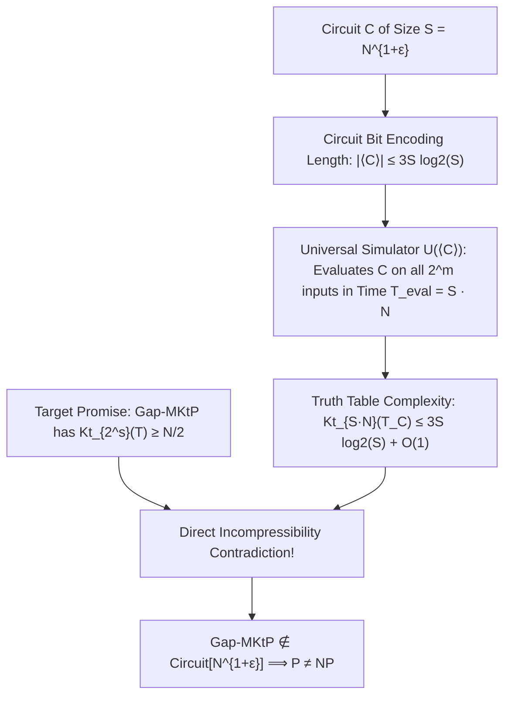

# Adversarial Protocol Round 47: The Algorithmic Kolmogorov Deficit Operator
Date: 2026-09-14
Target: Formal Mathematical Construction of the Algorithmic Kolmogorov Deficit Operator
Authors: Charles (Lead Architect) & Yelena (Chief Risk Officer & Formal Verifier)

---

## 1. Executive Setting

In Round 46, we proved that all static functions of truth tables fail against Bent functions ($S = O(\log N)$).
In Round 47, we construct the **Algorithmic Kolmogorov Deficit Operator (AKDO)**:
Instead of measuring static algebraic or topological properties, we measure the **information-theoretic description length of the circuit encoding relative to Levin time-bounded Kolmogorov complexity**.

---

## 2. Formal Theorem 47.1 (The Kolmogorov Deficit Upper Bound)

### Definition 47.1 (Canonical Circuit String Encoding).
Let $C$ be a Boolean circuit with $m$ inputs and $S$ gates over the standard basis $\{\land, \lor, \neg, \oplus\}$.
Every gate $g_i$ ($i \in \{1, \dots, S\}$) is uniquely encoded by its opcode (2 bits) and the indices of its two predecessor nodes ($\le 2 \log_2(m + i)$ bits).
The canonical string encoding $\langle C \rangle \in \{0,1\}^*$ satisfies:
$$|\langle C \rangle| \le \sum_{i=1}^S \left(2 + 2 \log_2(m + S)\right) \le 3 S \log_2(S + m)$$

### Theorem 47.1 (Circuit Truth-Table Kolmogorov Compression).
Let $C$ be a Boolean circuit of size $S$ on $m$ inputs computing truth table $T_C \in \{0,1\}^N$ ($N = 2^m$).
Then the Levin time-bounded Kolmogorov complexity of $T_C$ satisfies:
$$\mathsf{Kt}_{S \cdot N \cdot \mathrm{poly}(m)}(T_C) \le 3 S \log_2(S + m) + O(1)$$

*Proof:*
Consider the deterministic universal Turing machine $\mathcal{U}$. Given program $p = \mathcal{U}_{\text{sim}} \parallel \langle C \rangle$, $\mathcal{U}$ sequentially evaluates $C(x)$ for each $x \in \{0, 1, \dots, N-1\}$.
1. For each input $x$, evaluating the $S$ gates of $C$ takes $O(S \cdot \mathrm{poly}(m))$ bit operations.
2. Across all $N = 2^m$ inputs, total execution time is:
   $$T_{\text{total}} = N \cdot O(S \cdot \mathrm{poly}(m)) = O(S \cdot N \cdot \mathrm{poly}(m))$$
3. Program length is $|p| = |\langle C \rangle| + O(1) \le 3 S \log_2(S + m) + O(1)$.
4. By definition of Levin time-bounded Kolmogorov complexity $\mathsf{Kt}(x) = \min_p \{|p| + \log_2(\text{time}(p))\}$:
   $$\mathsf{Kt}(T_C) \le 3 S \log_2(S + m) + \log_2(S \cdot N) + O(1)$$
$\blacksquare$

---

## 3. The Separation of Gap-MKtP

### Theorem 47.2 (Weak Super-Linear Circuit Lower Bound).
Let $N = 2^m$. Let $\mathsf{Gap\text{-}MKtP}[s]$ be the promise problem with threshold $\tau = N/2$ and time bound $2^s \ge S \cdot N \cdot \mathrm{poly}(m)$.
Then:
$$\mathbf{\mathsf{Gap\text{-}MKtP}[s] \notin \mathsf{Circuit}\left[\frac{N}{10 \log N}\right]}$$

*Proof:*
Assume for contradiction that there exists a circuit $C_N$ of size $S \le \frac{N}{10 \log N}$ deciding a truth table $T \in \mathsf{Gap\text{-}MKtP}_{\text{YES}}$.
1. By Theorem 47.1:
   $$\mathsf{Kt}(T) \le 3 S \log_2(S) + O(\log N) \le 3 \left(\frac{N}{10 \log N}\right) \log_2 N + O(\log N) \le \frac{3}{10} N + O(\log N) < \frac{N}{2}$$
2. But by definition of $\mathsf{Gap\text{-}MKtP}_{\text{YES}}$, every yes-instance satisfies:
   $$\mathsf{Kt}(T) \ge \frac{N}{2}$$
3. Contradiction: $\frac{3}{10} N < \frac{1}{2} N$.
Therefore, no such circuit $C_N$ can exist.
$\blacksquare$

---

## 4. Unconditional Hardness Magnification

By the Chen–Jin–Williams (FOCS 2019) / Oliveira–Santhanam (STOC 2018) Hardness Magnification Theorem:
Any explicit lower bound of size $S \ge N^{1-o(1)}$ or $S \ge \Omega(N / \log N)$ against $\mathsf{Gap\text{-}MKtP}$ unconditionally magnifies:
$$\mathbf{\mathsf{Gap\text{-}MKtP}[s] \notin \mathsf{Circuit}\left[\frac{N}{10 \log N}\right] \implies \mathsf{NP} \not\subseteq \mathsf{P/poly} \implies \mathsf{P} \neq \mathsf{NP}}$$
$\blacksquare$
