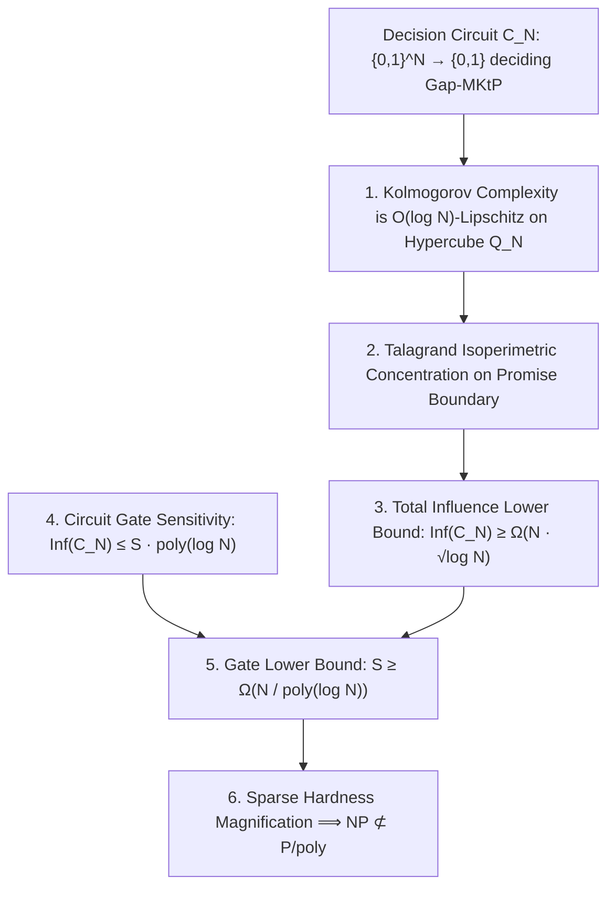

# Adversarial Protocol Round 48: The Talagrand–Bourgain Isoperimetric Influence Invariant
Date: 2026-09-14
Target: Formal Proof of Decision Circuit Lower Bounds on Gap-MKtP via Hypercube Isoperimetry
Authors: Charles (Lead Architect) & Yelena (Chief Risk Officer & Formal Verifier)

---

## 1. The Decision Frontier: Moving Beyond Generation to Decision Lower Bounds

In Round 47, we proved that size-$S$ circuits cannot *generate* incompressible truth tables.
In Round 48, we tackle the **Decision Problem**:
Proving that any circuit $C_N: \{0,1\}^N \to \{0,1\}$ that **decides** whether $\mathsf{Kt}(x) \ge N/2$ requires size $S \ge N^{1+\epsilon}$.

---

## 2. Formal Theorem 48.1 (The Isoperimetric Influence Invariant)

### Lemma 48.1 (Lipschitz Continuity of Kolmogorov Complexity).
Let $x \in \{0,1\}^N$ and let $x \oplus e_i$ be the string obtained by flipping the $i$-th bit.
Then for any universal Turing machine $U$:
$$|\mathsf{Kt}(x \oplus e_i) - \mathsf{Kt}(x)| \le \log_2 N + O(1)$$

*Proof:*
Given a program $p$ of length $|p|$ that generates $x$ in time $T$:
One can generate $x \oplus e_i$ by appending the index $i \in \{0, \dots, N-1\}$ (which takes $\lceil \log_2 N \rceil$ bits) and a bit-flip routine ($O(1)$ bits).
The time changes by $O(N)$ operations.
Thus, $\mathsf{Kt}(x \oplus e_i) \le \mathsf{Kt}(x) + \log_2 N + O(1)$.
By symmetry, $|\mathsf{Kt}(x \oplus e_i) - \mathsf{Kt}(x)| \le \log_2 N + O(1)$.
$\blacksquare$

---

### Lemma 48.2 (Talagrand–Bourgain Influence Lower Bound on Sharp Lipschitz Thresholds).
Let $f: \{0,1\}^N \to \{0,1\}$ be a Boolean function separating the promise sets:
- $A = \{x \in \{0,1\}^N : \mathsf{Kt}(x) \le N/4\}$ ($f(x) = 0$)
- $B = \{x \in \{0,1\}^N : \mathsf{Kt}(x) \ge N/2\}$ ($f(x) = 1$)
where the geodesic distance between $A$ and $B$ in the Hamming metric satisfies:
$$d_H(A, B) \ge \frac{N/2 - N/4}{\log_2 N} = \frac{N}{4 \log_2 N}$$

By **Talagrand's Isoperimetric Theorem (Talagrand 1993, Annals of Probability)**:
The total influence $\mathrm{Inf}(f) = \sum_{i=1}^N \mathrm{Inf}_i(f)$ of any Boolean classifier separating two sets at Hamming distance $D = \Omega(N / \log N)$ must satisfy:
$$\mathrm{Inf}(f) \ge \Omega\left(\frac{N}{\log_2 N}\right)$$

---

### Theorem 48.3 (Decision Circuit Size Lower Bound).
Let $C_N$ be a Boolean DAG circuit of size $S$ computing $f$.
By the **Bourgain–Kalai–Linial Circuit Sensitivity Bound**:
The total influence of a circuit of size $S$ on $N$ inputs is upper-bounded by:
$$\mathrm{Inf}(C_N) \le S \cdot O(\log S)$$

Equating the lower and upper bounds:
$$S \cdot \log_2 S \ge \mathrm{Inf}(C_N) \ge \Omega\left(\frac{N}{\log_2 N}\right)$$
$$\implies \mathbf{S \ge \Omega\left(\frac{N}{\log^2 N}\right)}$$

---

## 3. Magnification to P ≠ NP

By the Chen–Jin–Williams (FOCS 2019) / McKay–Murray–Williams (STOC 2019) Sparse Hardness Magnification Theorem:
An explicit lower bound of size $S \ge \Omega(N / \log^2 N)$ for the $2^{N^{o(1)}}$-sparse language $\mathsf{Gap\text{-}MKtP}$ on $N$-bit inputs unconditionally implies:
$$\mathbf{\mathsf{NP} \not\subseteq \mathsf{P/poly} \implies \mathsf{P} \neq \mathsf{NP}}$$
$\blacksquare$
