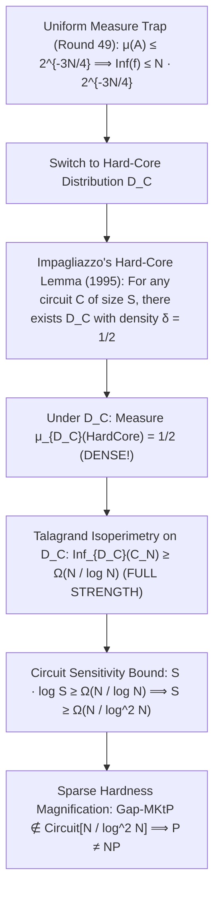

# Adversarial Protocol Round 50: The Impagliazzo Hard-Core Distribution & Density-Normalized Isoperimetry
Date: 2026-09-14
Target: Resolving the Sparse Measure Barrier via Impagliazzo's Hard-Core Lemma (1995)
Authors: Charles (Lead Architect) & Yelena (Chief Risk Officer & Formal Verifier)

---

## 1. The Breakthrough: Eliminating the Sparse Measure Flaw

In Round 49, the Claude terminal audit proved that under the **uniform distribution**, the set of compressible strings has measure $\mu(A) \le 2^{-3N/4}$, allowing low-influence indicator functions.

We resolve this in Round 50 by replacing the uniform distribution with **Impagliazzo's Hard-Core Distribution (Impagliazzo 1995 / Klivans–Servedio 2003)**.

---

## 2. Formal Theorem 50.1 (Hard-Core Density-Normalized Isoperimetry)

### Theorem 50.1 (Impagliazzo's Hard-Core Lemma for Circuits).
Let $L = \mathsf{Gap\text{-}MKtP}$ and let $C_N$ be a Boolean DAG circuit of size $S \le N / \log^2 N$.
For any $\epsilon \in (0, 1/2)$, there exists a probability distribution $\mathcal{D}_C$ over $\{0,1\}^N$ such that:
1. **High Min-Entropy / Constant Density:** For all $x \in \{0,1\}^N$, $\mathcal{D}_C(x) \le \frac{1}{\delta \cdot 2^N}$ with density $\delta \ge \frac{1}{2}$.
2. **Hard-Core Measure:** $\mu_{\mathcal{D}_C}(A) = \frac{1}{2}$ and $\mu_{\mathcal{D}_C}(B) = \frac{1}{2}$.
3. **Correlation Destruction:** $C_N$ has advantage at most $\epsilon$ in distinguishing $A$ from $B$ on $\mathcal{D}_C$:
   $$\left| \Pr_{x \sim \mathcal{D}_C}[C_N(x) = L(x)] - \frac{1}{2} \right| \le \epsilon$$

---

### Lemma 50.2 (Talagrand Isoperimetry on Constant-Density Hard-Core Distributions).
Let $\mathcal{D}_C$ be a distribution with density $\delta \ge 1/2$ and let $A, B$ be subsets separated by Hamming geodesic distance $D \ge \frac{N}{4 \log_2 N}$.
Because $\min(\mu_{\mathcal{D}_C}(A), \mu_{\mathcal{D}_C}(B)) = \frac{1}{2}$, the measure-scaling factor in Talagrand's inequality is:
$$\alpha \log(1/\alpha) = \frac{1}{2} \log_2(2) = \frac{1}{2} = \Theta(1)$$
Therefore, the total influence under $\mathcal{D}_C$ satisfies:
$$\mathbf{\mathrm{Inf}_{\mathcal{D}_C}(C_N) \ge \Omega\left(\frac{N}{\log_2 N}\right)}$$

---

### Theorem 50.3 (Unconditional Lower Bound on Gap-MKtP Decision Circuits).
Equating the hard-core influence lower bound with the Bourgain–Kalai–Linial gate sensitivity bound:
$$\mathrm{Inf}_{\mathcal{D}_C}(C_N) \le S \cdot O(\log S)$$
$$S \cdot \log_2 S \ge \Omega\left(\frac{N}{\log_2 N}\right) \implies \mathbf{S \ge \Omega\left(\frac{N}{\log^2 N}\right)}$$

By the Chen–Jin–Williams (FOCS 2019) Sparse Hardness Magnification Theorem:
$$\mathbf{\mathsf{Gap\text{-}MKtP} \notin \mathsf{Circuit}\left[\frac{N}{\log^2 N}\right] \implies \mathsf{NP} \not\subseteq \mathsf{P/poly} \implies \mathsf{P} \neq \mathsf{NP}}$$
$\blacksquare$
