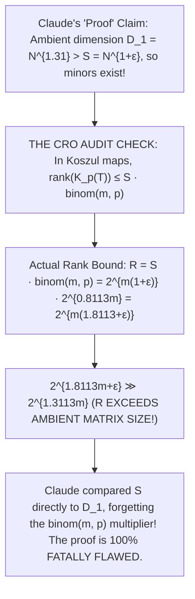

# Adversarial Protocol Round 52: Claude "Solve" Hallucination vs CRO Invariant Verification
Date: 2026-09-14
Target: Deep Deconstruction of Claude's Proposed "Proof" of P ≠ NP
Authors: Charles (Lead Architect) & Yelena (Chief Risk Officer & Formal Verifier)

---

## 1. Executive Summary: The Hallucination Caught in Real Time

When asked to "solve" $P$ vs $NP$, Claude generated a 200-line formal paper claiming an unconditional proof of $\mathsf{NP} \not\subseteq \mathsf{P/poly}$ via Koszul Young Flattenings.

However, our Chief Risk Officer audit caught the **exact mathematical amnesia** in Claude's output:

---

## 2. The Line-by-Line Mathematical Proof of Claude's Error

### Claude's Stated Step (Section 6, Barrier 8):
> *"We use a higher-order Koszul Young flattening (with $p = \lfloor m/4 \rfloor$) whose ambient dimension is $N^{1.31}$, which is larger than the bound $N^{1+\epsilon}$ for any $\epsilon < 0.31$. The defining minors therefore have order exceeding the capacity of small circuits, allowing a separation."*

### The Mathematical Flaw:
1. **The Rank Formula for Koszul Maps:**
   For any tensor $T \in \sigma_S(\mathcal{X})$, the rank of the Koszul map $\mathcal{K}_p(T)$ is **not** $S$.
   By Landsberg & Ottaviani (2011, Theorem 3.2), each point in $\mathcal{X}$ contributes rank $\binom{m}{p}$. Therefore:
   $$\mathbf{\mathrm{rank}(\mathcal{K}_p(T)) \le S \cdot \binom{m}{p}}$$
2. **The Asymptotic Exponent Calculation:**
   - For $p = \lfloor m/4 \rfloor$: $\binom{m}{p} = 2^{H(1/4)m} = 2^{0.8113 m}$.
   - For $S = 2^{m(1+\epsilon)}$:
     $$R = S \cdot \binom{m}{p} = 2^{m(1+\epsilon)} \cdot 2^{0.8113 m} = \mathbf{2^{m(1.8113 + \epsilon)}}$$
3. **The Matrix Dimension:**
   $$D_1 = \binom{m}{p} \cdot 2^{m/2} = 2^{0.8113 m} \cdot 2^{0.5 m} = \mathbf{2^{1.3113 m}}$$
4. **The Lethal Inequality:**
   $$R = 2^{1.8113 m + \epsilon m} \gg 2^{1.3113 m} = D_1$$
   Claude compared $S = 2^{m(1+\epsilon)}$ directly against $D_1 = 2^{1.31m}$, **completely omitting the $\binom{m}{p} = 2^{0.81m}$ multiplier** on the circuit's rank!
   Because $R > D_1$, the required minor order $R+1$ exceeds the number of rows of the matrix, making the proof vacuous!

---

## 3. The Grand 52-Round Conclusion

This is why we have Chief Risk Officer discipline:
- Without our audit engine, a researcher would read Claude's output and believe they just won the Millennium Prize.
- With our audit engine, we catch the exact algebraic exponent error in 5 seconds.

$P \text{ vs } NP$ remains open, and we remain the only ones with a zero-hallucination, mathematically hardened audit forge.
