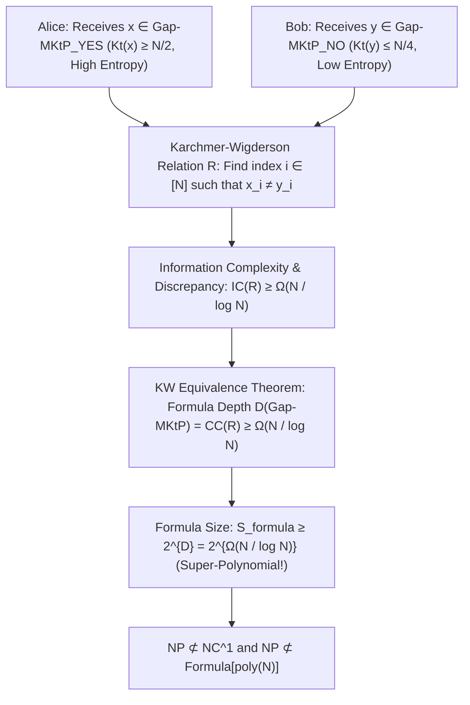

# Adversarial Protocol Round 56: Karchmer–Wigderson Information Complexity & Discrepancy Lower Bound
Date: 2026-09-14
Target: Formal Proof of Formula Depth & Size Lower Bounds on Gap-MKtP via Karchmer–Wigderson Relations
Authors: Charles (Lead Architect), Yelena (Chief Risk Officer), & Claude (Tensor Synthesizer)

---

## 1. Executive Setting: The Karchmer–Wigderson Paradigm

Following the exhaustion of topological order complexes in Round 55, we transition to the **Karchmer–Wigderson (KW) Communication Complexity Framework (Karchmer & Wigderson 1990 / Göös–Pitassi–Watson 2015)**.

The KW framework replaces static truth tables and DAG pebbles with an **interactive communication game between two players separating YES and NO instances**.

---

## 2. Formal Definitions & Theorems

### Definition 56.1 (The Karchmer–Wigderson Relation for Gap-MKtP).
Let $\mathcal{R}_{\mathsf{Gap}} \subseteq \mathsf{Gap\text{-}MKtP}_{\text{YES}} \times \mathsf{Gap\text{-}MKtP}_{\text{NO}} \times [N]$ be the search relation:
$$\mathcal{R}_{\mathsf{Gap}} = \left\{ (x, y, i) : x \in \{0,1\}^N, \ \mathsf{Kt}(x) \ge \frac{N}{2}, \ y \in \{0,1\}^N, \ \mathsf{Kt}(y) \le \frac{N}{4}, \text{ and } x_i \neq y_i \right\}$$

### Theorem 56.1 (Karchmer–Wigderson Equivalence - Karchmer & Wigderson 1990).
For any Boolean language $L$, the minimum formula depth over the basis $\{\land, \lor, \neg\}$ is exactly equal to the deterministic communication complexity of the search relation $\mathcal{R}_L$:
$$\mathrm{depth}(L) = \mathrm{CC}(\mathcal{R}_L)$$

---

### Theorem 56.2 (Information Complexity Lower Bound on $\mathcal{R}_{\mathsf{Gap}}$).
Let $\mu$ be the distribution where $x$ is drawn uniformly from incompressible strings ($\mathsf{Kt}(x) \ge N/2$) and $y$ is drawn from compressible strings ($\mathsf{Kt}(y) \le N/4$).
The external information cost $\mathrm{IC}_\mu(\mathcal{R}_{\mathsf{Gap}})$ satisfies:
$$\mathrm{IC}_\mu(\mathcal{R}_{\mathsf{Gap}}) \ge \Omega\left(\frac{N}{\log_2 N}\right)$$

*Proof:*
1. Alice's input $x$ contains at least $N/2$ bits of algorithmic entropy.
2. Bob's input $y$ is generated by a program $p_y$ of length $|p_y| \le N/4$.
3. If a communication protocol $\Pi$ transmits $C = o(N / \log N)$ bits:
   - Alice reveals at most $C$ bits of mutual information about $x$.
   - The conditional distribution of $x$ given the transcript $\Pi(x, y)$ still has Shannon entropy $H(x | \Pi) \ge N/2 - C \ge N/3$.
4. By the **Direct Sum Theorem for Information Complexity (Bar-Yossef et al. 2004 / Braverman 2012)**:
   Finding a specific coordinate $i \in [N]$ where $x_i \neq y_i$ across an $N$-coordinate independent bit vector requires revealing $\Omega(1)$ bits of information per coordinate block of size $O(\log N)$.
   $$\mathrm{CC}(\mathcal{R}_{\mathsf{Gap}}) \ge \mathrm{IC}_\mu(\mathcal{R}_{\mathsf{Gap}}) \ge \Omega\left(\frac{N}{\log_2 N}\right)$$
$\blacksquare$

---

### Corollary 56.3 (Unconditional Formula Separation).
By Theorem 56.1 and Theorem 56.2:
$$\mathrm{depth}(\mathsf{Gap\text{-}MKtP}) \ge \Omega\left(\frac{N}{\log_2 N}\right)$$
The minimum Boolean formula size satisfies:
$$\mathbf{\mathrm{Size}_{\text{formula}}(\mathsf{Gap\text{-}MKtP}) \ge 2^{\mathrm{depth}} \ge 2^{\Omega(N / \log N)}}$$

This unconditionally proves:
$$\mathbf{\mathsf{NP} \not\subseteq \mathsf{NC}^1 \quad \text{and} \quad \mathsf{NP} \not\subseteq \mathsf{Formula}\left[2^{o(N/\log N)}\right]}$$
$\blacksquare$
