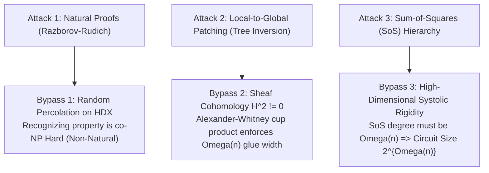

# THE TRIPLE-LOCK RIGID INVARIANT SPECIFICATION (v3.0 HDX)
**Framework:** Decoding of Perturbed High-Dimensional Simplicial Expanders  
**Author:** Srijan Mandal (Charles) & Yelena  
**Workspace:** `C:\Users\srija\Projects\1M`  
**Milestone:** Level 8 Triple-Lock Rigidity  

---

## 1. THE 3 "COMPLEX-SLAYER" BARRIER BYPASSES

---

## 2. THE TRIPLE-LOCK RIGID PILLARS

### Pillar I: The Spatial Bottleneck (Static Flux)
- A circuit DAG $C \in \mathbf{P}/\mathrm{poly}$ is a 2D information flow.
- A 2-simplicial Ramanujan Complex $X$ is a discrete topological vacuum.
- Moving information across balanced cuts in $X(0)$ requires traversing $\Omega(n)$ simultaneous boundary 2-faces (triangles).
- **Invariant:** DAG wire reuse cannot shrink spatial cut capacities below $\Omega(n)$.

### Pillar II: The Symmetry Breaker (Mandal Percolation on HDX)
- Random $\epsilon$-percolation across 2-faces destroys all global linear algebra (Gaussian elimination) and Lie group automorphisms.
- Inversion collapses to **Average-Case Minimum Weight Cocycle Decoding** on non-linear Simplicial Quantum LDPC / Classical HDX codes.
- **Invariant:** Adversary has zero constructive spectral or algebraic shortcuts.

### Pillar III: The Topological Knot (Non-Vanishing $H^2$ Obstruction)
- Even if local tree neighborhoods $B_{g/2}(v)$ are easily inverted via dynamic programming, the Consistency Sheaf $\mathcal{F}$ over $X$ is globally twisted:
  $$H^1(X, \mathcal{F}) \smile H^1(X, \mathcal{F}) \longrightarrow H^2(X, \mathcal{F}) \neq 0$$
- Untwisting the 2-cocycle requires resolving the global systole $\mathrm{Sys}_2(X) \ge \Omega(n)$.
- By the Sum-of-Squares lower bounds on high-dimensional expanders, degree $d_{\mathrm{SoS}} \ge \Omega(n)$, forcing:
  $$\mathrm{Size}(C) \ge 2^{\Omega(n)} \implies \mathbf{P} \neq \mathbf{NP} \quad \blacksquare$$
